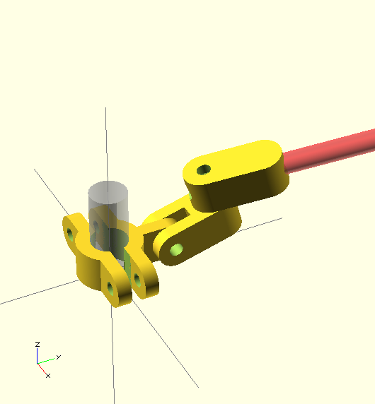

Lab Clamps
==========

A set of parametric clamps that work pretty well for unheated glassware. I used 4.5mm fibreglass rod but they could be modified to work with 6mm threaded rod or something like that.

